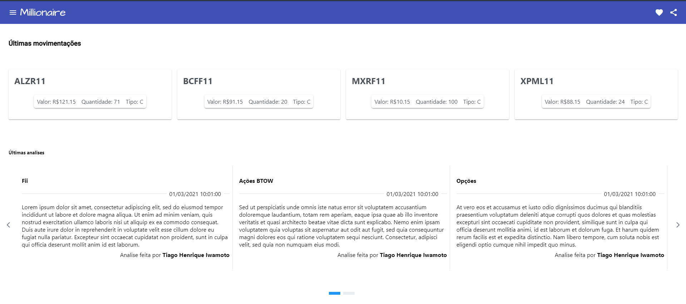
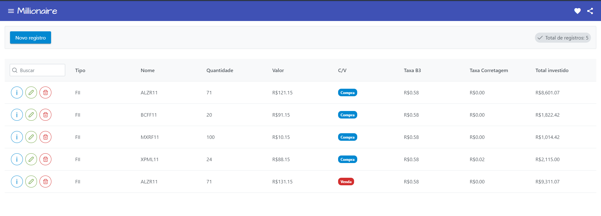
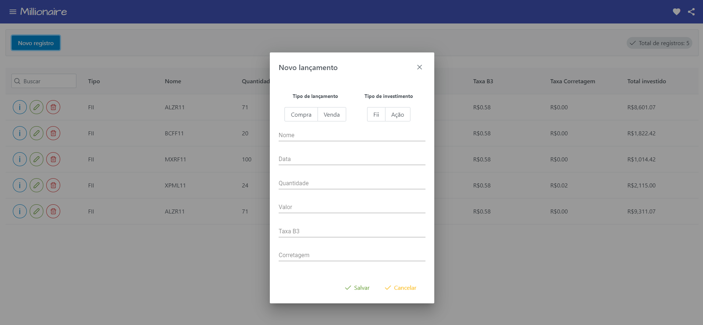
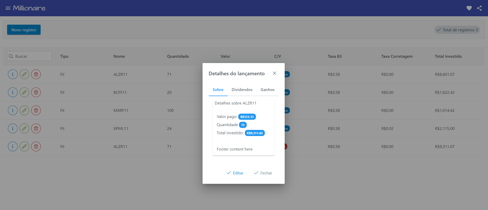
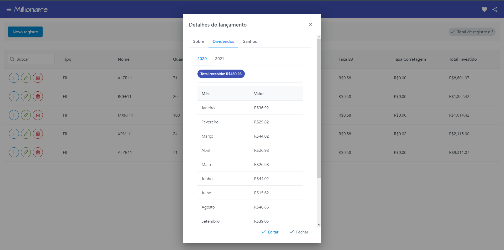
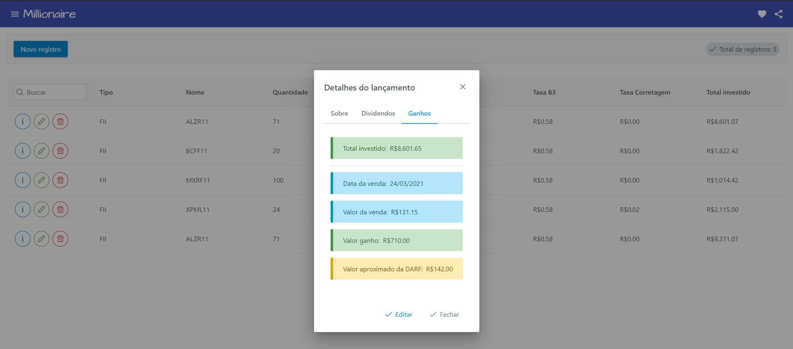

### Millionaire
    Esta aplicação tem como objetivo organizar seus investimentos na bolsa de valores.
    Com este controle é muito mais fácil de fazer a declaração de imposto de renda.
    Você não vai precisar esperar cada administradora enviar o informe de rendimento.
    Este software não vende nenhuma informação e não apresenta qualquer propaganda.
    É totalmente online e temos a versão no navegador e em breve o app para Android.
    Oferecemos em 3 versões:
      Web
      Android (em breve)
      Planilhas

### Prints

### Gostou ?
Desenvolvido por Tiago Henrique Iwamoto

Github: https://tiagoiwamoto.github.io

Linkedin: https://www.linkedin.com/in/tiago-iwamoto/

Gostou ? Poderia me pagar um café ?

[Via picpay R$ 5,00](https://picpay.me/tiagoiwamoto/5.0)

Via Pix: tiago.iwamoto@gmail.com
